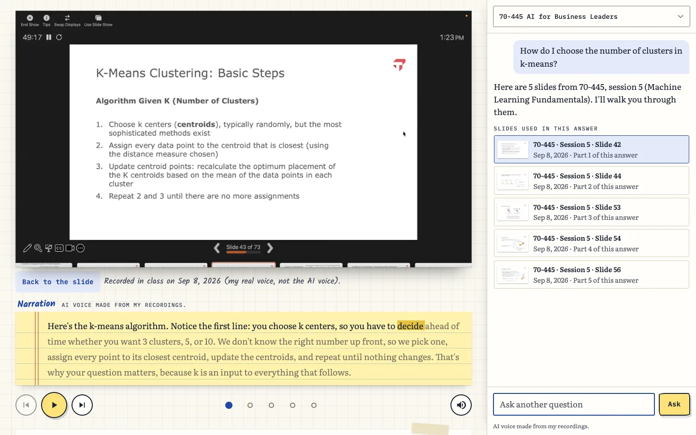
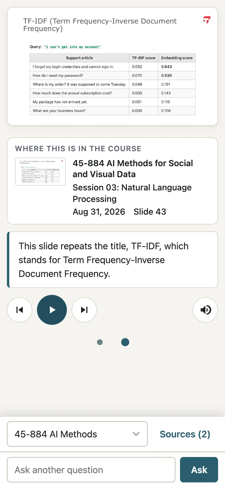
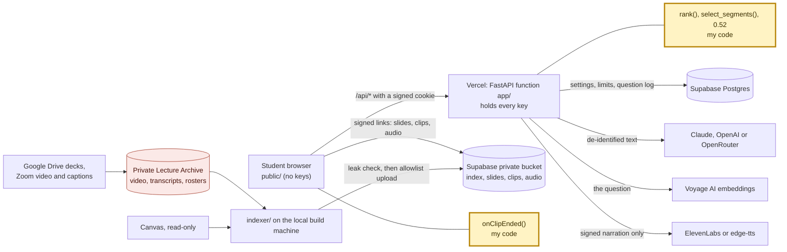
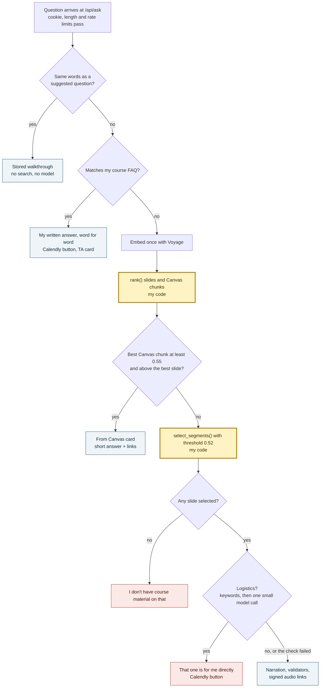

# Effective Coding with AI: Project 2

Ben Collier · CMU 15-113 Effective Coding with AI · Fall 2026

**The project is [Faculty Twin](#5-faculty-twin-the-project).** If you grade one thing, grade that. The other four are the experiments that got me there: each one taught me a piece of what Faculty Twin needed, from turning messy data into a chart a reader can trust, to calling Apple's Vision API from Python over my own photos, to making a language model follow rules inside an app.

| # | Experiment | What I was learning | Live | Code |
| --- | --- | --- | --- | --- |
| 1 | Teaching evaluations and Strengths | Data visualization and synthesis with AI | [evaluations](https://ben.collier.phd/evaluations/) · [strengths](https://ben.collier.phd/strengths/) | [site repo](https://github.com/bcollier/ben.collier.phd) |
| 2 | Travel map | Apple's Vision API from Python, plus photo GPS metadata | [travel](https://ben.collier.phd/travel/) | [README](https://github.com/bcollier/ben.collier.phd/tree/main/travel) |
| 3 | Reels | Apple's Vision API from Python for faces, plus semantic photo search | [reels](https://ben.collier.phd/reels/) | [README](https://github.com/bcollier/ben.collier.phd/tree/main/reels) |
| 4 | Connections About You | An LLM as a game engine | [play the demo](https://bcollier.github.io/connections_demo/) | [connections_demo](https://github.com/bcollier/connections_demo) |
| 5 | **Faculty Twin** | Vector search, narration, voice, slides and class video | [faculty-twin.vercel.app](https://faculty-twin.vercel.app) (passcode) | [faculty-twin](https://github.com/bcollier/faculty-twin) |

The demo video: _link here_ · Video script and stage directions: [VIDEO_SCRIPT.md](VIDEO_SCRIPT.md) · Prompt log (tools per job, where AI got it wrong, key prompts verbatim): [faculty-twin/prompt_log.md](https://github.com/bcollier/faculty-twin/blob/main/prompt_log.md)

---

## 1. Data visualization with AI: teaching evaluations and Strengths

**The question:** can an AI coding agent turn raw, sensitive data into a page a reader can trust?

- **Teaching evaluations** ([compare](https://ben.collier.phd/evaluations/), [version A](https://ben.collier.phd/evaluations-a/), [version B](https://ben.collier.phd/evaluations-b/)): two interactive analyses of my de-identified course evaluations, with the time window and response counts stated on the chart so nobody over-reads a small sample.
- **Strengths** ([page](https://ben.collier.phd/strengths/), [prompt log](https://github.com/bcollier/ben.collier.phd/blob/main/strengths/prompt_log.md)): what two StrengthsFinder results, five years apart, say about how I work. Synthesis rather than a chart dump.

**What carried into Faculty Twin:** charts start at zero, every scale is labeled, and counts travel with every percentage. The eval report card in Faculty Twin follows the same rules.

## 2. Apple Vision integration: the travel map

[ben.collier.phd/travel](https://ben.collier.phd/travel/) · [README](https://github.com/bcollier/ben.collier.phd/tree/main/travel)

An interactive map and globe of the 27 countries and 55 US cities I have photographed, built from my own Apple Photos library: 129,597 photos scanned, 48,280 with GPS, 287 chosen. Python read the library read-only (osxphotos), reverse-geocoded offline, called Apple's Vision API from Python, on device, to drop screenshots, selfies and photos with people, and exported small WebP files with location data stripped.

**What carried into Faculty Twin:** private data is processed on my own machine and only safe results are published.

## 3. Apple Vision: Reels

[ben.collier.phd/reels](https://ben.collier.phd/reels/) · [README and prompt log](https://github.com/bcollier/ben.collier.phd/tree/main/reels)

172 photos of me from 2000 to 2026, cut into a music video drawn in the browser with WebGL and two slideshows. Apple's Vision API, called from Python on my Mac, finds every face and body in a photo, and each photo is cropped until mine is the only face or it is left out; a second check runs on the final crop. OpenCLIP, a local image embedding model, does semantic search and sorting ("me at work" versus "me everywhere else") without sending a photo anywhere.

**What carried into Faculty Twin:** embeddings for search, and a two-pass privacy check where the second pass catches what the first missed. Faculty Twin matches class video frames to slides, and checks every clip again before it is cut.

## 4. Connections About You: an LLM as a game engine

[Play the demo](https://bcollier.github.io/connections_demo/) · [Source](https://github.com/bcollier/connections_demo) · [How a puzzle is made](https://github.com/bcollier/connections_demo#how-a-puzzle-is-made)

A word game in the style of NYT Connections where a language model with web search writes four groups of four about a person. The model is the game engine, so the app checks every puzzle before anyone plays it: a schema, sixteen different words, and retries when a rule is broken.

**What carried into Faculty Twin:** never trust model output on its own. Faculty Twin validates every narration (slide ids, word caps, grounding, PG, no names, no access codes) and falls back to my own speaker notes when a check fails.

## 5. Faculty Twin (the project)

[faculty-twin.vercel.app](https://faculty-twin.vercel.app) (passcode for students and graders) · [Repo](https://github.com/bcollier/faculty-twin) · [Spec](https://github.com/bcollier/faculty-twin/blob/main/docs/SPEC.md) · [Prompt log](https://github.com/bcollier/faculty-twin/blob/main/prompt_log.md) · [Data and evals page](https://htmlpreview.github.io/?https://github.com/bcollier/faculty-twin/blob/main/docs/demo/data-and-evals.html)

An AI version of me that teaches from my own slides. A student asks a course question and gets the slides from this semester, in order, narrated in an AI voice made from my recordings, with a card saying which course, session, date and slide it came from, and a short clip of me explaining that slide in class.

| A walkthrough | The class clip | On a phone |
| --- | --- | --- |
|  |  |  |

*Screenshots of the live site, October 8, 2026. More, with notes on each: [faculty-twin/docs/screenshots](https://github.com/bcollier/faculty-twin/blob/main/docs/screenshots/README.md).*

| Piece | What it does |
| --- | --- |
| Vector search | Each slide's text, speaker notes, recognized image text and what I said in class while it was up, embedded with Voyage AI. My hand-written `rank()` and `select_segments()` pick the slides; my threshold (0.52) decides when to decline. |
| Narration | Claude (or OpenAI or OpenRouter, switchable in Settings) writes first-person narration from those slides only. Code checks every line before it is spoken. |
| Voice | My ElevenLabs voice clone, stock voices, or free Microsoft voices. The voice only says text the server signed. |
| Slides and video | 974 slides from two courses, 329 class clips matched to slides by comparing video frames to slide images. |
| Privacy | Every person named except me is removed from transcripts, student speech is left out, and a roster check runs before anything is uploaded. Content is behind a passcode. |
| Testing | 800+ automated tests, a security review, and an eval harness that runs 22 real (de-identified) student questions past two AI judges from different companies. |

**APIs and services it uses:**

| Service | What it does in Faculty Twin |
| --- | --- |
| Anthropic API (Claude) | Writes the narration. Default Claude Sonnet 5.5; Opus 5.5 and Haiku 4.5 can be picked in Settings. Claude Opus 5.5 is also one of the eval judges. |
| OpenAI API | The second narration option (GPT-6.1 Sol, GPT-6 Luna, GPT-6 Astra) and the second eval judge (GPT-6.1 Sol), so answers are graded by a model from another company. |
| OpenRouter | A third narration option: one key for Claude and other models. |
| Voyage AI | Embeddings (voyage-3.5) for the slide search index and for each question. |
| ElevenLabs | My voice clone and the stock voices (eleven_multilingual_v2), with a daily character cap. |
| Microsoft neural voices (edge-tts) | Free voices with no key, and the fallback when ElevenLabs fails or reaches its cap. |
| Apple Vision | Reads the text in slide images (OCR) on my Mac while the index is built. |
| Zoom transcripts and Whisper | What I said in class: Zoom's captions, with Whisper transcripts where a recording had none. De-identified before indexing. |
| TypeSafe Jev | Explored as a third, probability-scoring eval judge (command line only). |
| Supabase | Postgres for settings, rate limits, daily caps and the question log; private Storage for slides, clips, the index and audio, reached only through short-lived signed links. |
| Vercel | Hosts the app (static files) and the API (one Python function). Every key lives in its environment variables. |

### How it works

The browser never holds a key and never calls a model. It talks to one FastAPI function on Vercel, which checks the passcode cookie, searches, writes and checks the narration, and signs every link. Course content sits in a private Supabase bucket, built ahead of time on the computer that holds my lecture archive, so rosters, raw transcripts and full class video never leave it. The yellow boxes are the code I wrote by hand.

Every question takes one path, cheapest first:

All seven diagrams (one question step by step, the content pipeline, privacy boundaries, the Settings page, the eval harness and these two), with explanations: [faculty-twin/docs/ARCHITECTURE.md](https://github.com/bcollier/faculty-twin/blob/main/docs/ARCHITECTURE.md).
